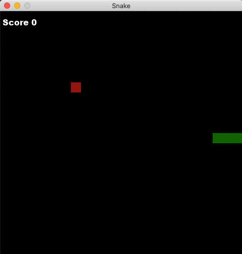

# Snake

Classic snake



## Install Pygame

Use the package manager [pip](https://pip.pypa.io/en/stable/) to install Pygame

```bash
python3 -m pip install -U pygame --user
```

## Run
```bash
python main.py
```
## Controls

W/Up Arrow - Up

A/Left Arrow - Left

S/Down Arrow - Down

D/Right Arrow - Right

M - Mute
